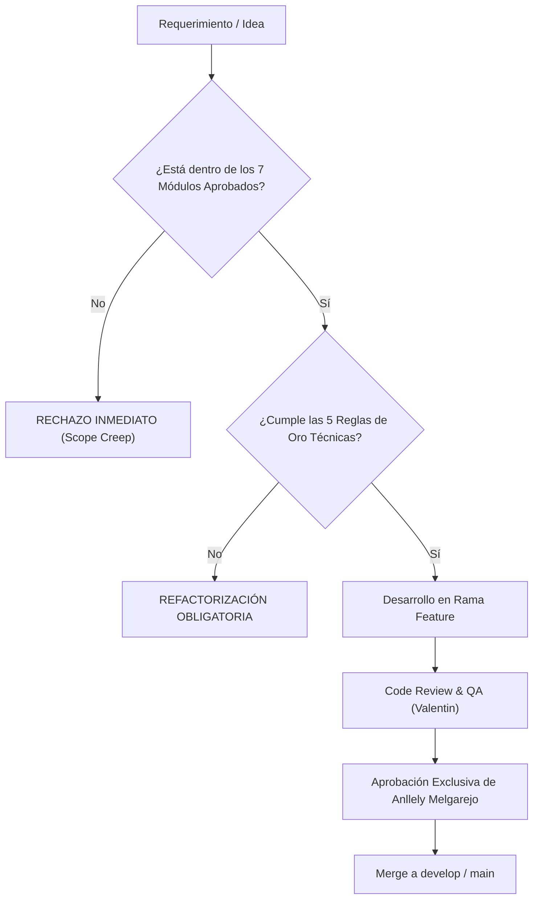
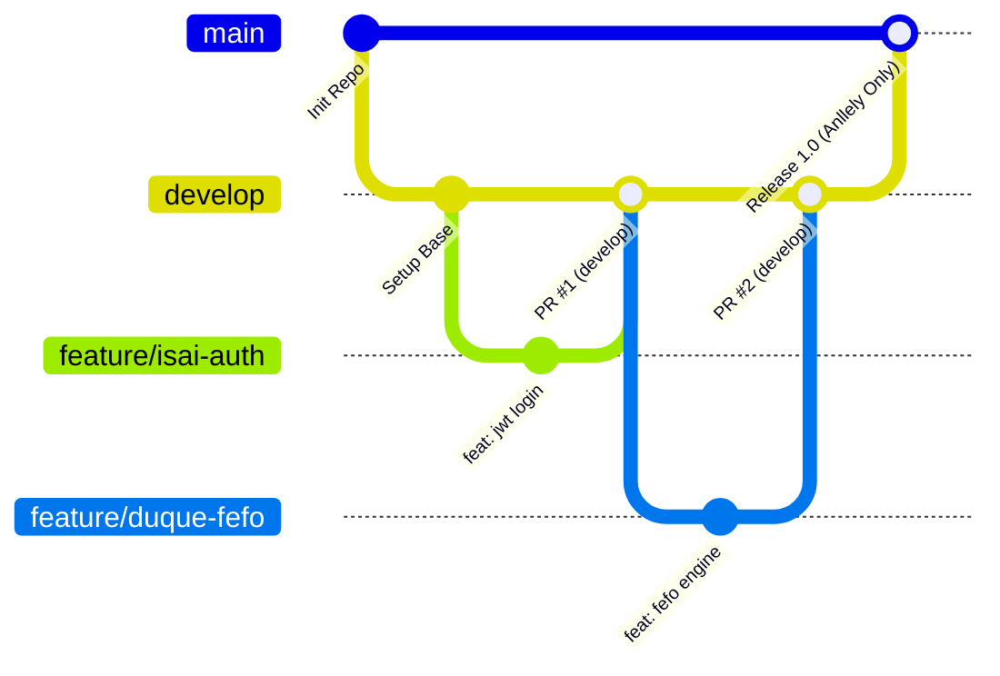

# 🛡️ MASTER PLAN & CONTRATO DE ALCANCE NO NEGOCIABLE
## Sistema de Gestión de Inventario y Control de Almacén (SGI-Almacén)

> **Documento Oficial de Ingeniería, Arquitectura y Gobierno de Proyecto**  
> **Versión:** 1.0.0 — Baseline Definitiva (Scope Locked)  
> **Fecha de Emisión:** 30 de Septiembre de 2026  
> **Autoridad Técnica:** CTO & Scrum Master Principal  
> **Administradora del Repositorio:** Anllely Melgarejo (`main` Branch Gatekeeper)

---

## 📌 1. DECLARACIÓN EJECUTIVA Y "SCOPE LOCK"

El presente documento constituye el **Contrato Técnico y Operativo No Negociable** para el desarrollo, control de calidad y entrega del proyecto **SGI-Almacén**. Su propósito primario e ineludible es **CERRAR EL ALCANCE (Scope Lock)**.

A partir de la firma y publicación de este documento:
1. **Queda congelado el alcance funcional y arquitectónico.** No se aceptarán solicitudes de cambio (*change requests*), características accesorias (*nice-to-have*) ni expansiones de funcionalidad sin un proceso formal de enmienda aprobado por unanimidad por el CTO y la Líder General.
2. **Cero tolerancia al "Scope-Creep".** Toda línea de código introducida que no pertenezca estrictamente a los 7 módulos autorizados será rechazada en fase de Pull Request sin excepción.
3. **Prioridad Absoluta a la Calidad e Integridad de Datos.** El sistema prioriza la consistencia matemática del inventario, la inmutabilidad de auditoría y la velocidad operativa sobre el exceso de pantallas o artificios visuales.



---

## 📦 2. LOS 7 MÓDULOS APROBADOS (ALCANCE DEFINITIVO)

El sistema se compone única y exclusivamente de los siguientes **siete (7) módulos funcionales**:

| N° | Módulo | Objetivo Central | Líderes de Implementación |
|---|---|---|---|
| **01** | **Catálogo Maestro de Artículos y Ubicaciones** | Administración de fichas de producto, control de SKUs, códigos de barras, unidades de medida y coordenadas físicas tridimensionales (Zona-Estante-Fila). | Isai Huaman (Back) <br> Tania Tapullima (Front) |
| **02** | **Recepción y Conteo Ciego (Entradas)** | Registro de ingresos de stock físico mediante doble ciego (sin precargar cantidades teóricas) para forzar el conteo real, asignando lote y fecha de vencimiento. | Duque (Back) <br> Tania Tapullima (Front) |
| **03** | **Salidas Asistidas y Despacho FEFO** | Despacho algorítmico automatizado bajo metodología FEFO (*First Expired, First Out*), bloqueo de sobregiro y emisión del Vale de Salida imprimible. | Duque (Back) <br> Jhasy (Front) |
| **04** | **Monitor de Stock y Semáforo Visual** | Tablero de control operativo con alertas cromáticas instantáneas (Verde, Ámbar, Rojo) basadas en stock mínimo y punto de reposición, con filtros rápidos. | Jhasy (Front) <br> Isai Huaman (Back) |
| **05** | **Kárdex Inmutable y Valuación Contable** | Libro mayor transaccional *append-only* (solo inserciones), cálculo continuo de Costo Promedio Ponderado (CPP) y soporte para ajustes auditados de faltantes/sobrantes. | Duque (Back) <br> Anllely Melgarejo (DB) <br> Jhasy (Front) |
| **06** | **Compras Sugeridas y Reportes Operativos** | Cálculo algorítmico de reposición ($Stock_{Máximo} - Stock_{Actual}$), generación de lista de compra en 1 clic y exportación de inventario valorizado a CSV/PDF. | Valentin (Fullstack / QA) |
| **07** | **Seguridad, Autenticación JWT y RBAC** | Control de acceso perimetral mediante JSON Web Tokens, cifrado de credenciales con `bcryptjs` y aislamiento de privilegios por roles con HTTP 403. | Isai Huaman (Back) |

---

## 🚫 3. CLÁUSULA ANTI SCOPE-CREEP: QUÉ ESTÁ ESTRICTAMENTE PROHIBIDO AÑADIR

Para salvaguardar el cumplimiento de los tiempos de entrega, la estabilidad del código y el enfoque del equipo, se declara **ESTRICTAMENTE FUERA DE ALCANCE (OUT OF SCOPE)** lo siguiente:

> [!CAUTION]
> Cualquier Pull Request o intento de commit que contenga elementos de la siguiente lista negra será cerrado de inmediato con estado `Closed / Won't Fix`.

1. ❌ **PROHIBIDO: Pasarelas de Pago e Integraciones Bancarias.**
   - Queda vetada la inclusión de Stripe, PayPal, MercadoPago, Niubiz, transferencias bancarias o cobros online. SGI-Almacén es una plataforma de **gestión logística interna y control de existencias**, no una tienda e-commerce B2C.
2. ❌ **PROHIBIDO: Facturación Electrónica con Firmas Digitales Complejas.**
   - No se implementarán conexiones SOAP/REST con entidades tributarias (SUNAT, SAT, DIAN), ni generación de XML UBL, ni firma digital con certificados X.509. El campo `documento_sustento` en el Kárdex almacenará únicamente el número de referencia documental (ej. "GUIA-00124", "FAC-9081") para auditoría física.
3. ❌ **PROHIBIDO: Aplicaciones Móviles Nativas.**
   - No se desarrollarán clientes en Flutter, React Native, Swift (iOS) ni Kotlin (Android). La solución está 100% estandarizada como una Single Page Application (SPA) web en React + Vite + Tailwind CSS, responsiva y operable desde cualquier navegador moderno en laptops, estaciones de pesaje y tabletas de almacén.
4. ❌ **PROHIBIDO: Arquitecturas de Microservicios Sobrecargadas.**
   - Queda vetada la división en microservicios independientes, orquestación con Kubernetes, Kafka, RabbitMQ, Service Meshes o Event Sourcing distribuido. El sistema se construye bajo una **Arquitectura Monolítica Modular Limpia** (Node.js/Express + PostgreSQL + React). Prioriza transacciones ACID locales y despliegue simple.
5. ❌ **PROHIBIDO: Bots de Mensajería y Notificaciones Push Complejas.**
   - Cero integraciones con la API de WhatsApp Twilio, Telegram Bots, SMS gateways o web push workers. El sistema notifica dentro de la propia interfaz mediante su Semáforo Visual y alertas en pantalla.

---

## 💎 4. LAS 5 REGLAS DE ORO TÉCNICAS NO NEGOCIABLES

Estas reglas son principios inviolables de arquitectura e ingeniería de software. Un fallo en cualquiera de estas reglas invalida cualquier entrega:

### 🥇 Regla de Oro 1: Bloqueo de Stock Negativo a Tres Capas
Bajo ninguna circunstancia matemática ni operativa una existencia de artículo o lote puede registrar una cantidad menor a cero ($Stock \ge 0$).
* **Capa 1 (Frontend):** Validadores de formulario que impiden ingresar cantidades de salida mayores al saldo mostrado.
* **Capa 2 (Backend):** Bloqueo transaccional. Si un despacho solicita $N$ unidades y el stock disponible total o por lote es $< N$, la transacción se aborta arrojando `HTTP 400 Bad Request` con mensaje de error explícito.
* **Capa 3 (Base de Datos):** Restricciones de integridad duras a nivel de motor:
  ```sql
  CHECK (stock_disponible >= 0) -- Tabla lotes
  CHECK (saldo_cantidad >= 0)    -- Tabla kardex
  ```

### 🥈 Regla de Oro 2: Inmutabilidad Absoluta del Kárdex (Append-Only Ledger)
La tabla `kardex` funciona como un libro mayor contable financiero.
* **Sentencias Permitidas:** Única y exclusivamente `INSERT`.
* **Sentencias Terminantemente Prohibidas:** `UPDATE` y `DELETE`.
* **Ajustes y Descuadres:** Si durante una auditoría física se detecta una merma, rotura o sobrante, **jamás se modifica un registro anterior**. Se inserta una nueva transacción con tipo `AJUSTE_SOBRANTE` o `AJUSTE_FALTANTE`, documentando el motivo y usuario responsable.

### 🥉 Regla de Oro 3: Despacho Automatizado FEFO Estricto (*First Expired, First Out*)
El criterio de qué lote se despacha lo toma el algoritmo del sistema, no la intuición del operario de almacén.
* En cada salida, el backend consulta automáticamente los lotes disponibles ordenados por fecha de expiración ascendente:
  ```sql
  SELECT id, stock_disponible, fecha_vencimiento 
  FROM lotes 
  WHERE articulo_id = $1 AND stock_disponible > 0 
  ORDER BY fecha_vencimiento ASC;
  ```
* Se consumen los lotes más viejos en vencimiento antes de tocar lotes nuevos, minimizando la merma por caducidad.

### 🏅 Regla de Oro 4: Recepción y Auditoría con Conteo Ciego (*Blind Counting*)
En el Módulo de Entradas, el sistema combate el fraude y la pereza operativa:
* La pantalla y el endpoint de recepción física **NO deben precargar ni mostrar** la cantidad esperada de una orden de compra o envío.
* El operario está obligado a contar físicamente cada unidad y registrar el dato verídico. Si el conteo discrepa del documento de compra, la discrepancia queda registrada para revisión administrativa.

### 🎖️ Regla de Oro 5: Seguridad Perimetral y RBAC con HTTP 403 Forbidden
La seguridad no es cosmética ni exclusiva de la vista en React; se valida en el motor del backend en cada petición.
* Todo endpoint sensible (`POST`, `PUT`, `DELETE`) exige un token JWT válido verificado por middleware.
* Si un usuario con rol `CONSULTA` intenta realizar una inserción, modificación o borrado, el backend responde de inmediato con:
  ```json
  HTTP 403 Forbidden
  {
    "error": "Acceso denegado: Se requieren privilegios de ALMACENERO o ADMINISTRADOR"
  }
  ```

---

## 👥 5. MATRIZ DE RESPONSABILIDADES Y CONTRATOS TÉCNICOS

```
+-----------------------------------------------------------------------------------+
|                            ANLLELY MELGAREJO                                      |
|                 Líder General / Arquitecta DB / Admin 'main'                      |
+-----------------------------------------------------------------------------------+
          |                                                       |
          v                                                       v
+-----------------------+                               +-----------------------+
|      BACKEND CORE     |                               |     FRONTEND CORE     |
| Isai Huaman (Seg/Cat) |                               | Tania T. (Captura/Bar)|
| Duque (FEFO/Kardex)   |                               | Jhasy (Dash/Semáforo) |
+-----------------------+                               +-----------------------+
          \                                                       /
           \--------------------------+--------------------------/
                                      |
                                      v
                       +-----------------------------+
                       |    FULLSTACK & QA TESTER    |
                       |    Valentin (Compras/QA)    |
                       +-----------------------------+
```

### 5.1 Fichas Técnicas Individuales

#### 1. Anllely Melgarejo — Líder General, Arquitecta de DB y Custodia de `main`
* **Misión:** Diseñar la base de datos relacional, asegurar integridad referencial física, administrar la infraestructura de ramas y ser la **única aprobadora de Pull Requests a `main`**.
* **Entregables:**
  - Script DDL definitivo (`base-de-datos/01_schema.sql`).
  - Índices de alto rendimiento para escaneo y FEFO (`idx_articulos_barcode`, `idx_articulos_sku`, `idx_lotes_fefo`).
  - Configuración de Branch Protection Rules en GitHub.
  - Revisiones de código (Code Reviews) con foco en no-regresión.

#### 2. Isai Huaman — Backend Developer (Seguridad, RBAC y Catálogo Maestro)
* **Misión:** Desarrollar el sistema de autenticación centralizada, el control de acceso basado en roles y el catálogo maestro de artículos.
* **Entregables:**
  - Endpoint `POST /api/auth/login` con generación de JWT firmado.
  - Encriptación con `bcryptjs` (salt rounds $\ge 10$).
  - Middlewares: `verificarToken` y `verificarRol(['ADMINISTRADOR', 'ALMACENERO'])`.
  - Endpoints CRUD de Catálogo:
    - `GET /api/articulos`: Listado con soporte de filtros.
    - `POST /api/articulos`: Alta con validación de SKU y barcode únicos.
    - `PUT /api/articulos/:id`: Actualización de umbrales y coordenadas de ubicación.
    - `DELETE /api/articulos/:id`: Baja lógica obligatoria (cambio de estado a `INACTIVO` o `DESCONTINUADO`).

#### 3. Duque — Backend Developer (Lógica Transaccional, FEFO y Kárdex)
* **Misión:** Desarrollar el motor transaccional del almacén bajo consistencia ACID absoluta.
* **Entregables:**
  - Endpoint `POST /api/movimientos/entradas`: Registro de recepción a ciegas, creación de lote y actualización de Costo Promedio Ponderado.
  - Endpoint `POST /api/movimientos/salidas`: Despacho inteligente consumiendo lotes ordenados por `fecha_vencimiento ASC` y bloqueo de stock negativo.
  - Endpoint `POST /api/movimientos/ajustes`: Registro de descuadres auditados (`AJUSTE_SOBRANTE`, `AJUSTE_FALTANTE`).
  - Transacciones atómicas seguras en PostgreSQL (`BEGIN ... COMMIT / ROLLBACK`).
  - Tabla `kardex` estrictamente en modo *Append-Only*.

#### 4. Tania Tapullima — Frontend Developer (Captura Rápida y Códigos de Barras)
* **Misión:** Construir las interfaces de registro y optimizar la interacción ergonómica con escáneres USB de código de barras.
* **Entregables:**
  - Formulario React reactivo para alta y edición de artículos.
  - Selector y visor visual del estado del artículo (Activo/Inactivo/Descontinuado).
  - Manejador de eventos para escáner USB Plug & Play (autofoco en campo de búsqueda + captura del evento `Enter` sin clic de mouse).
  - Integración de renderizado de códigos de barras (ej. `jsbarcode`) y módulo de impresión de etiquetas para estanterías.

#### 5. Jhasy — Frontend Developer (Dashboard, Semáforo y Vales de Salida)
* **Misión:** Programar el monitor de existencias visual, la trazabilidad del Kárdex y la emisión de comprobantes internos de despacho.
* **Entregables:**
  - Panel Dashboard con Semáforo de Stock:
    - 🟢 **Verde:** Existencias seguras ($Stock > Stock_{mínimo}$).
    - 🟡 **Ámbar:** Punto de reposición ($0 < Stock \le Stock_{mínimo}$).
    - 🔴 **Rojo:** Agotado o crítico ($Stock = 0$).
  - Buscador multifiltro instantáneo (SKU, nombre, categoría, zona-estante-fila).
  - Pantalla de asistencia al despacho (muestra ubicación exacta del lote asignado por FEFO).
  - Componente de impresión del **Vale de Salida** con estilos CSS `@media print`.
  - Visualizador tabular del Kárdex con paginación y filtros de fecha.

#### 6. Valentin — Fullstack / QA Tester (Compras Sugeridas, Reportes y E2E)
* **Misión:** Implementar la lógica de compras sugeridas, generadores de reportes y liderar el aseguramiento de calidad (QA) de extremo a extremo.
* **Entregables:**
  - Algoritmo y vista de **Compras Sugeridas**:
    $$\text{Cantidad a Solicitar} = \text{Stock Máximo} - \text{Stock Actual}$$
  - Filtro para aplicar compras únicamente a productos en estado Ámbar o Rojo.
  - Módulo de exportación de inventario valorizado a formato CSV (Excel) y PDF.
  - Matriz de Pruebas de Integración E2E (flujo completo: Catálogo $\to$ Entrada $\to$ Semáforo $\to$ Salida FEFO $\to$ Kárdex $\to$ Reporte).

---

## 🔄 6. CONTRATO DE INTERFACES Y FORMATO DE DATOS (API REST)

Para evitar incompatibilidades entre Frontend y Backend, se fijan los siguientes contratos de intercambio:

### 6.1 Autenticación (JWT Payload)
```json
{
  "id": 1,
  "nombre": "Anllely Melgarejo",
  "email": "anllely@sgi.com",
  "rol": "ADMINISTRADOR",
  "iat": 1727697600,
  "exp": 1727726400
}
```

### 6.2 Catálogo de Artículos (`GET /api/articulos`)
```json
[
  {
    "id": 10,
    "sku": "MED-PAR-500",
    "codigo_barras": "7750123456789",
    "nombre": "Paracetamol 500mg - Caja 100",
    "categoria": "Farmacia",
    "unidad_medida": "Caja",
    "stock_total": 45,
    "stock_minimo": 20,
    "stock_seguridad": 10,
    "stock_maximo": 100,
    "semaforo": "VERDE",
    "ubicacion": {
      "zona": "A",
      "estante": "03",
      "fila": "02"
    },
    "estado": "ACTIVO"
  }
]
```

### 6.3 Despacho FEFO (`POST /api/movimientos/salidas`)
**Request Payload:**
```json
{
  "articulo_id": 10,
  "cantidad": 15,
  "documento_sustento": "VALE-2026-0045"
}
```
**Response 200 OK:**
```json
{
  "mensaje": "Salida procesada exitosamente mediante FEFO",
  "lotes_afectados": [
    {
      "lote_id": 3,
      "numero_lote": "LOT-2025-A",
      "fecha_vencimiento": "2026-11-15",
      "cantidad_descontada": 15,
      "stock_restante_lote": 5
    }
  ],
  "saldo_total_articulo": 30,
  "kardex_id": 501
}
```

---

## 🌿 7. PROTOCOLO DE GIT Y POLÍTICAS DE PULL REQUEST

El control del repositorio es el activo más crítico para evitar regresiones y roturas de la base de código.



### 7.1 Arquitectura de Ramas
* `main`: **Rama de Producción.** Intocable. Solo recibe código probado proveniente de `develop` mediante Pull Request aprobado y ejecutado por **Anllely Melgarejo**.
* `develop`: **Rama de Integración.** Es el punto de convergencia donde se integran todas las características terminadas.
* `feature/<autor>-<descripcion>`: Ramas de trabajo para cada funcionalidad específica (ejemplo: `feature/tania-barcode-reader`, `feature/duque-salidas-fefo`).
* `fix/<autor>-<descripcion>`: Ramas para corrección de bugs detectados por QA.

### 7.2 Reglas Inviolables de Trabajo en Git
1. **PROHIBIDO PUSH DIRECTO A `main` O `develop`:** Todo cambio debe entrar obligatoriamente vía **Pull Request**.
2. **Convención de Commits (Conventional Commits):**
   - `feat:` Nuevas funcionalidades dentro de alcance.
   - `fix:` Corrección de fallos o bugs.
   - `docs:` Modificaciones en documentación técnica.
   - `test:` Casos de prueba automatizados o unitarios.
   - `refactor:` Mejoras de código sin alterar comportamiento.
3. **Custodia Exclusiva de `main`:**
   - La rama `main` cuenta con Branch Protection activada en GitHub.
   - **Solo Anllely Melgarejo tiene facultades de Merge a `main`.** Cualquier intento de bypass será sancionado.

### 7.3 Checklist Obligatorio para Aprobación de Pull Requests (PR Gate)
Antes de aprobar cualquier PR a `develop` o `main`, Anllely verificará el cumplimiento estricto de:
- [ ] ¿El cambio pertenece a uno de los 7 módulos aprobados? (Sin Scope Creep).
- [ ] ¿Respeta la no negatividad de stock?
- [ ] ¿Mantiene la inmutabilidad del Kárdex (sin `UPDATE` ni `DELETE`)?
- [ ] ¿Se ejecutó el linter (`npm run lint`) sin advertencias ni errores graves?
- [ ] ¿Se eliminaron todos los `console.log` de depuración y variables de entorno quemadas?
- [ ] ¿Fue probado y validado por QA (Valentin)?

---

## 📅 8. CRONOGRAMA DE HITOS Y DEFINITION OF DONE (DoD)

| Hito | Alcance | Criterio de Aceptación (DoD) | Responsables |
|---|---|---|---|
| **Hito 1: Cimientos y Catálogo** | Base de datos PostgreSQL + Auth JWT + Catálogo CRUD con interfaz inicial y soporte USB. | Tablas creadas, login funcional con tokens, artículos editables e inicio de lectura con escáner. | Anllely, Isai, Tania |
| **Hito 2: Motor Transaccional** | Recepción ciega de entradas + Despacho FEFO + Kárdex inmutable en transacciones SQL. | Entradas y salidas atómicas, verificación de stock no negativo y registro Kárdex en PostgreSQL. | Duque, Anllely |
| **Hito 3: Visibilidad y Operación** | Dashboard de Semáforo de Stock + Impresión de Vale de Salida + Impresión de Códigos. | Cambio visual verde/ámbar/rojo interactivo, vales de salida limpios listos para imprimir en papel. | Jhasy, Tania |
| **Hito 4: Inteligencia y Certificación** | Módulo de Compras Sugeridas + Exportación PDF/CSV + Pruebas Integrales E2E. | Generación de compras con 1 clic, reportes descargables y matriz de pruebas al 100% sin bugs críticos. | Valentin, Equipo Completo |
| **Hito 5: Release 1.0 (Scope Freeze)** | Integración final en `develop`, auditoría de código, merge a `main` por Anllely y entrega. | Sistema desplegado, documentación completa y alcance cerrado sin desviaciones. | Anllely (Líder) |

---

## ✍️ 9. COMPROMISO Y CONFORMIDAD DEL EQUIPO

Con la publicación de este documento en el repositorio central de **SGI-Almacén**, los 6 integrantes declaran conocer, acatar y defender las cláusulas aquí estipuladas:

* **Anllely Melgarejo** — Líder General & Arquitecta de Base de Datos
* **Isai Huaman** — Backend Developer (Seguridad & Catálogo)
* **Duque** — Backend Developer (Transacciones & FEFO)
* **Tania Tapullima** — Frontend Developer (Captura & Hardware)
* **Jhasy** — Frontend Developer (Dashboard & Monitoreo)
* **Valentin** — Fullstack Developer & QA Tester
